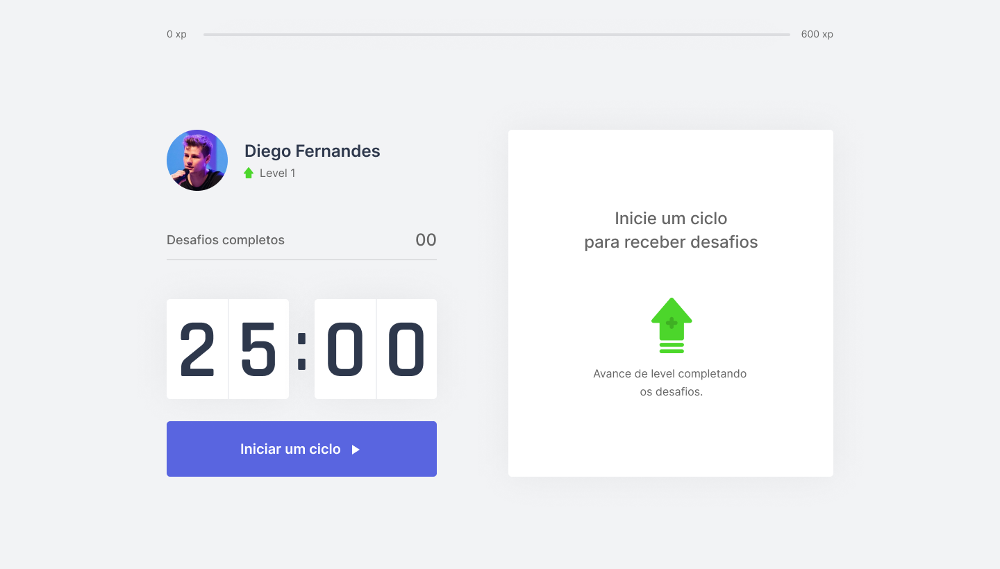
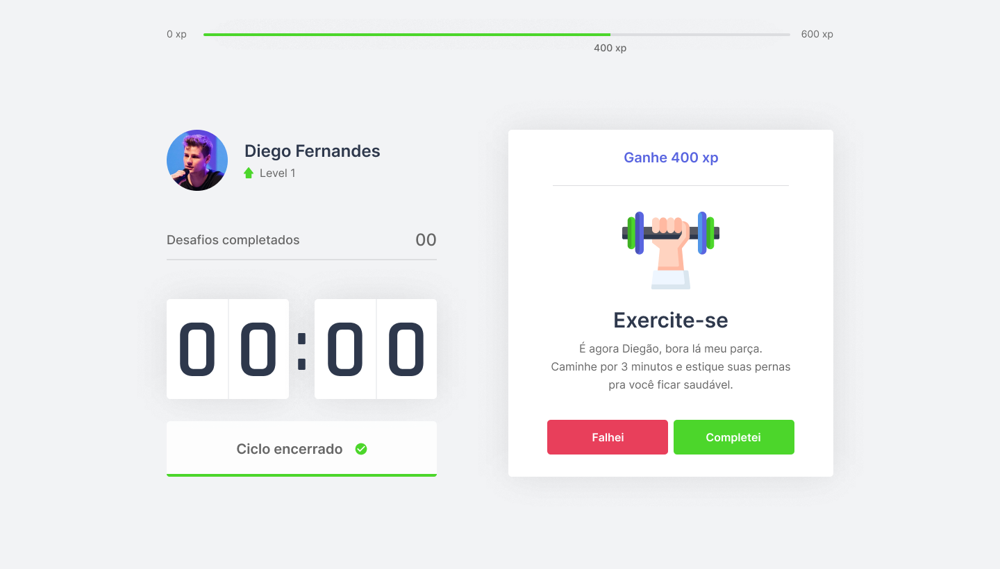

<h1 align="center">  MoveIt -- NLW#4 </h1>

<h4 align="center"> ✅ Finalizado ✅ </h4>

 <a href="#-sobre-o-projeto">Sobre</a> •
 <a href="#-funcionalidades">Funcionalidades</a> •
 <a href="#-layout">Layout</a> • 
 <a href="#-como-executar-o-projeto">Como executar</a> • 
 <a href="#-tecnologias">Tecnologias</a> • 
 <a href="#-autora">Autor</a> 

## 💻 Sobre o projeto

MoveIt foi criado com o intuito de ajudar pessoas que passam muito tempo em frente ao computador a realizar uma pausa e fazer uma atividade durante um determinado período.
Ele é baseado na técnica de [Pomodoro](https://pt.wikipedia.org/wiki/Técnica_pomodoro), consistindo em curtos ciclos de trabalho/estudo acompanhados de uma pequena pausa.
Dessta forma, a cada atividade concluída, no tempo de pausa, o usuário recebe um XP e assim vai aumentando de nível ao atingir a meta máxima.

O MoveIt é um projeto desenvolvido na NLW#4 realizado pela Rocketseat e ministrada pelo CTO Diego Fernandes. O NLW é uma experiência online com muito conteúdo prático, desafios e hacks onde o conteúdo fica disponível durante uma semana.

## ⚙️ Funcionalidades

- [x] Experience Bar (experiência atual e a necessária para o próximo level)
- [x] Profile 
- [x] Completed Challenges
- [x] Countdown (de 25min)
   + Iniciar ciclo
   + Abandonar ciclo
   + Finalizar ciclo
- [x] Definir desafios
- [x] Falhar no desafio
   + Resetar desafios
   + Resetar tempo
- [x] Completar desafio
   + Aumentar XP
   + Resetar tempo
   + Passar para o próximo desafio
- [x] Notificação de novo desafio disponível
   + Exibir notificação no browser
   + Inserir áudio de notificação
- [x] Passar de level após completar a barra de XP
- [ ] Exibir modal quando avançar de nível

## 🎨 Layout

O layout da aplicação está disponível no Figma e foi feito pelo Tiago Luchtenberg:

### Web

  

  

