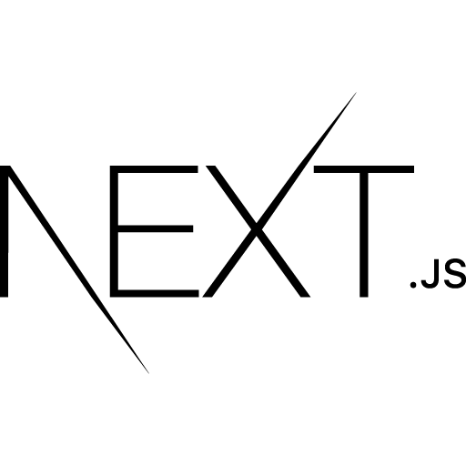

<h1 align="center">  MoveIt -- NLW#4 </h1>

<h4 align="center"> ✅ Finalizado ✅ </h4>


<p align="center">
 <a href="#-sobre-o-projeto">Sobre</a> •
 <a href="#-tecnologias">Tecnologias</a> • 
 <a href="#-layout">Layout</a> • 
 <a href="#-como-executar-o-projeto">Como executar</a> • 
 <a href="#-autor">Autor</a> 
</p>


## 💻 Sobre o projeto

MoveIt foi criado com o intuito de ajudar pessoas que passam muito tempo em frente ao computador a realizar uma pausa e fazer uma atividade durante um determinado período.
Ele é baseado na técnica de [Pomodoro](https://pt.wikipedia.org/wiki/Técnica_pomodoro), consistindo em curtos ciclos de trabalho/estudo acompanhados de uma pequena pausa.
Dessta forma, a cada atividade concluída, no tempo de pausa, o usuário recebe um XP e assim vai aumentando de nível ao atingir a meta máxima.

O MoveIt é um projeto desenvolvido na NLW#4 realizado pela Rocketseat e ministrada pelo CTO Diego Fernandes. O NLW é uma experiência online com muito conteúdo prático, desafios e hacks onde o conteúdo fica disponível durante uma semana.

O deploy do projeto foi feito pelo [Vercel](https://vercel.com) e você pode vê-lo em [**MoveIt**](https://moveit-three-flame.vercel.app)


## ⚙️ Funcionalidades

- [x] Experience Bar (experiência atual e a necessária para o próximo level)
- [x] Profile 
- [x] Completed Challenges
- [x] Countdown (de 25min)
   + Iniciar ciclo
   + Abandonar ciclo
   + Finalizar ciclo
- [x] Definir desafios
- [x] Falhar no desafio
   + Resetar desafios
   + Resetar tempo
- [x] Completar desafio
   + Aumentar XP
   + Resetar tempo
   + Passar para o próximo desafio
- [x] Notificação de novo desafio disponível
   + Exibir notificação no browser
   + Inserir áudio de notificação
- [x] Passar de level após completar a barra de XP
- [ ] Exibir modal quando avançar de nível


## 🛠 Tecnologias

As seguintes ferramentes foram usadas na construção da aplicação:


### **Website** ([Next.js](https://nextjs.org/) + [TypeScript](https://www.typescriptlang.org/))

-  **[React](https://pt-br.reactjs.org/)**
-  **[Node.js](https://nodejs.org/en/)**


     <p>
     
     
     
     
    </p>

> Confira o arquivo [package.json](https://github.com/JonatasDuarte/move.it/blob/next/package.json)


## 🎨 Layout

O layout da aplicação está disponível no Figma e foi feito pelo Tiago Luchtenberg:

<a href="https://www.figma.com/file/ge20pu3ofMOKoliUyKx1Nl/?viewer=1&node-id=160:2761">
  
</a>


### Web

<p align="center" style="display: flex; align-items: flex-start; justify-content: center;">
  

  
</p>


## 🚀 Como executar o projeto


### Pré-requisitos para execução do projeto

Antes de tudo, é preciso ter em sua máquina as seguintes ferramentas:
[Git](https://git-scm.com), [Node.js](https://nodejs.org/en/). 

Além de um editor para trabalhar com o código, como o [VSCode](https://code.visualstudio.com/)


#### ⌨ Rodando a aplicação web (Front-end)

```bash

# Clone este repositório
$ git clone git@github.com:JonatasDuarte/move.it

# Acesse a pasta do projeto no seu terminal
$ cd move.it

# Vá para a pasta da aplicação
$ cd move.it

# Instale as dependências
$ npm install ou yarn install

# Execute a aplicação em modo de desenvolvimento
$ npm run dev ou yarn dev

# A aplicação será aberta na porta:3000 no seu browser - acesse http://localhost:3000

```


## 💪 Quer contribuir para o projeto?! Então segue os passos

1. Faça um **fork** do projeto
2. Crie uma nova branch com as suas alterações: `git checkout -b my-feature`
3. Salve as alterações e crie uma mensagem de commit contando o que você fez: `git commit -m "feature: My new feature"`
4. Envie as suas alterações: `git push origin my-feature`

- Caso queira saber mais sobre como contribuir em um projeto no git: [Clique aqui](https://imasters.com.br/desenvolvimento/como-contribuir-com-um-projeto-no-github#:~:text=Faça%20um%20branch%20para%20cada,(Pull%20Request)%20no%20GitHub.)


## 👨‍💻 Autor

<p align="left">
  <a href="mailto:jonatasilvaduarte@gmail.com" alt="Gmail">
  </a>

  <a href="https://www.linkedin.com/in/jonatas-duarte/" alt="Linkedin">
  </a>

  </p>  

Feito com 💙 por [Jonatas Duarte](https://github.com/JonatasDuarte)